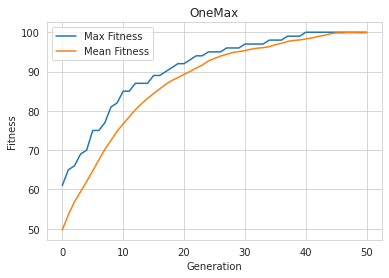

## 1️⃣0️⃣1️⃣0️⃣ OneMax Problem
### Task:
Find the bitstring of a given length (N) that maximizes the sum of its digits.

`Formally`\
Find a string $\vec x = \\{x_{1}, x_{2},\dots{}, x_{N} \\}$ of length $N$ where $x_{i} \in \{0,1\} $ that maximizes:

$$F(\vec x) = \sum_{i=1}^{N} x_{i}$$

### Example:
For $N = 4$,
|Bitstring|Sum|
|-------|---------|
|0️⃣0️⃣0️⃣0️⃣|$0$|
|1️⃣0️⃣1️⃣0️⃣|$2$|
|1️⃣0️⃣1️⃣1️⃣|$3$|
|1️⃣1️⃣1️⃣1️⃣|$4$|

$$F(\vec x) = x_{1} + x_{2} + x_{3} + x_{4} = 1 + 1 + 1 + 1 = 4$$

The problem is solved using Genetic Algorithm and python framework [DEAP](https://deap.readthedocs.io/en/master/).

## ⚙ Usage
```bash
git clone https://github.com/SrjPdl/OneMax-GA.git
pip install -r requirements.txt
```
If `pip` doesn't work use `pip3` instead of `pip`.

## ▶ Result
|Generation|Avg. Fitness|Max. Fitness|
|---------|-------------|-------------|
0  	|   	49.695	|61 
1  	|   	53.575	|65 
2  	|   	56.855	|66 
3  	|   	59.42 	|69 
4  	|   	62.03 	|70 
5  	|   	64.715	|75 
6  	|   	67.515	|75 
7  	|   	70.215	|77 
8  	|   	72.475	|81 
9  	|   	74.79 	|82 
10 	|   	76.685	|85 
... |   	...	    |...
30 	|   	95.325	|97 
31 	|   	95.69 	|97 
32 	|   	95.93 	|97 
33 	|   	96.085	|97 
34 	|   	96.325	|98 
35 	|   	96.835	|98 
... |   	...	    |...
41 	|   	98.55 	|100
42 	|   	98.915	|100
43 	|   	99.195	|100
44 	|   	99.595	|100
45 	|   	99.82 	|100
46 	|   	99.82 	|100
47 	|   	99.895	|100
48 	|   	99.875	|100
49 	|   	99.83 	|100
50 	|   	99.89 	|100

### 📈Generation vs Fitness


## 🚀 Author
**Suraj Poudel**

## 📝 License
[](https://opensource.org/licenses/MIT)


